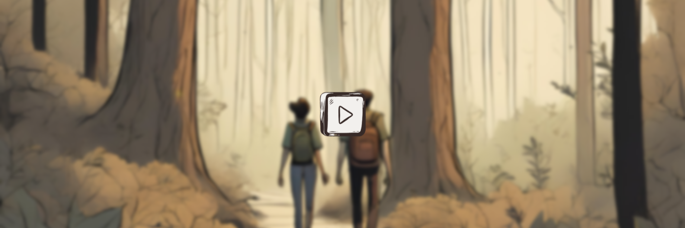

<h1 id="hi-there-i-m-beno-t-baguelin-">Hi there, I&#39;m Benoît Baguelin 👋</h1>

I am currently pursuing a Master&#39;s degree at <a href="https://ensea.fr/">ENSEA</a>, a French graduate school specializing in electrical engineering and computer science. My interests span the full spectrum of technology, from low-level hardware design to high-level software development, with a focus on software engineering, embedded systems, and cybersecurity.
  

<h2 id="-my-skills-" align="center">🚀 My Skills 🚀</h2>
<h3 id="-programming-languages-">Programming Languages:</h3>
<ul>
   <li>General   </li>
   <li>Back-end   </li>
   <li>Front-end   </li>
   <li>Low-level   </li>
   <li>Others  </li>
</ul>

<h3 id="-frameworks-and-libraries-">Frameworks and Libraries:</h3>
<ul>
   <li>Front-end    
         
   </li>
   <li>Back-end   </li>
</ul>

<h3 id="databases">Databases:</h3>
<ul>
   <li>SQL   </li>
   <li>NoSQL   </li>
</ul>

<h3 id="-development-environments-">Development Environments:</h3>
<ul>
   <li>Embedded Platforms   </li>
   <li>Linux Environment   </li>
</ul>

<h3 id="electronic-design-and-simulation-softwares">Electronic design and simulation softwares:</h3>
<ul>
   <li>
      Vivado, OrCAD, PSpice
   </li>
</ul>
  
<h2 id="-my-main-personal-web-projects-" align="center">💻 My main personal web projects 💻</h2>
<h3 id="-sabotime-">Sabotime</h3>

Online multiplayer game | 2023 | <a href="https://sabotime.com/">https://sabotime.com/</a>      

Sabotime is my main web project. It’s an online multiplayer game inspired by the board game Time Bomb. I developed the game entirely, both frontend and backend, with graphic elements created in collaboration with a team and professional designers. This project includes 3D graphics, live chat, account creation, and all the features that make it a complete game. The game was a real success, remaining online for about a month and attracting around 500 unique users. The game is no longer live due to legal reasons.

<h3 id="-rando-audio-">Rando Audio</h3>

Interactive audio story | 2024 | <a href="https://rando-audio.fr/">https://rando-audio.fr/</a>    

The Rando Audio project is the graduation project of Simon Nölp. It’s an interactive audio story where the listener can make choices and shape their own adventure.

<h3 id="-bde-ensea-">BDE ENSEA</h3>

Student Union Website | 2024 | <a href="https://bde.asso-ensea.fr/">https://bde.asso-ensea.fr/</a>  

  

In 2024, I developed the website for my student union, the BDE. Serving as the association&#39;s online showcase, the site was built using the Next.js framework, providing a modern and efficient platform to represent our activities.

<h3 id="-la-glycine-">La Glycine</h3>

Tourist rentals Website | 2019 | <a href="https://laglycine-asnelles.fr/">https://laglycine-asnelles.fr/</a>     

At the age of 16, I created my second showcase website, which is still in use today. This site highlights and promotes vacation rentals in Normandy. One of its key features is a small administration panel, including password-protected login and a database, enabling the publication of short posts directly on the site. This project provided me with an introduction to system security.
  

<h2 id="-contact-me-" align="center">📧 Contact Me 📧</h2>

Feel free to reach out if you&#39;d like to collaborate or have any questions!

<ul>
   <li>Email: <a href="mailto:benoit.baguelin@ensea.fr">benoit.baguelin@ensea.fr</a></li>
   <li>LinkedIn: <a href="https://www.linkedin.com/in/benoit-baguelin/">/in/benoit-baguelin</a></li>
   <li>Curriculum vitæ : <a href="./CV%20STAGE%202025%20FR.pdf">CV.pdf</a></li>
</ul>
